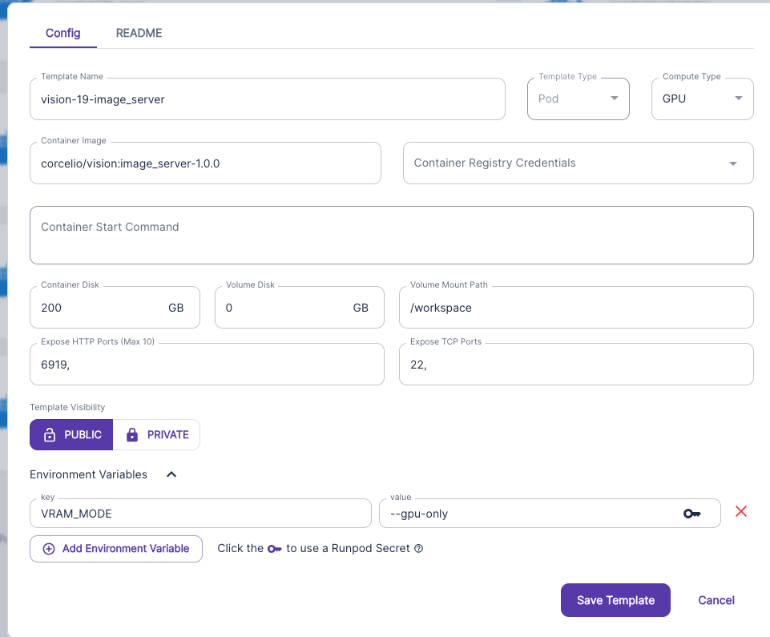

# Full instructions for setup

Welcome to S19 Mining 🔥


## Contents:

- [Worker server setup](#worker-server-setup)
- [Proxy server setup](#proxy-server-setup)
- [LLM server configs](#model-configs)


# Overview
A miner consists of serveral parts, fitting into two categories:

- Proxy
- Workers

The proxy server is the server which has your hotkey, and spins up the axon (should probably be on a CPU close to your GPU worker servers). The worker servers are the GPU workers which perform the tasks!

I would advise starting with the worker servers. The simplest way to get started is to spin up four worker servers:

- One for the mixtral chat model
- One for the image generation stuff
- One for the llama3 chat model

# Worker server setup
I recommend using bare metal where possible. The documentation for bare metal can be found in here https://github.com/namoray/vision-workers

Below is the documentation for a template provder, such as runpod:

**⚠️USE 11.8 <= CUDA <=12.2 For an easier life! ⚠️**

## Template setup
I'll use runpod as example, as it's easy with them

### Chat (LLM) servers

FOR MORE INFO ON BARE METAL SETUP; READ [HERE](https://github.com/namoray/vision-workers/blob/main/llm_server/README.md)

- Navigate to https://www.runpod.io/console/user/templates
Create a new template


- **Fill out the template like this, but look below for all the different ennvironment variables**


### Model configs
Mixtral
```
MODEL TheBloke/Nous-Hermes-2-Mixtral-8x7B-DPO-GPTQ
HALF_PRECISION true
REVISION gptq-8bit-128g-actorder_True
```


Llama-3
```
MODEL casperhansen/llama-3-70b-instruct-awq
HALF_PRECISION true
TOKENIZER tau-vision/llama-3-tokenizer-fix
```

It's very important that port 6919 is exposed here, as well as TCP port 22 ( so you can ssh in if you need to)

- **Create a GPU pod with this instance**
- Pick a GPU, pick a template, and you're off! and you're off!
NOTE: I advise you use a estup with at least 80GB vram (H100 or A100 for example)

NOTE DONT USE THE TEMPLATE BELOW, ITS JUST AN EXAMPLE :D


## Image worker
Very similar steps, just a slightly different template! 

For detailed info on setup; read this [image_server_docs](https://github.com/namoray/vision-workers/blob/main/image_server/README.md)


I would recommend either a RTX4090 or H100 or A100


#### Getting the address of the servers
Navigate to one of the pods, click 'connect', and then click the orange button, and copy the URL in your browser


# Proxy server setup

Get a CPU VM (Digital Ocean Droplet, OVH, Vultr, etc)  - make sure you have an open port if you want to run a organic API server.
**Note: Runpod CPU's don't seem to be the best**
If you pick a runpod cpu, i would advise running this
```bash
ulimit -n 4096
```


## Setup environment

Note: if you're using a provider such as runpod or vast, make sure you expose the necessary ports first, e.g.: https://docs.runpod.io/docs/expose-ports#:~:text=If%20your%20pod%20supports%20a,address%20to%20access%20your%20service. Follow the "Symmetrical port mapping" step :)

### Clone the repo
```bash
git clone https://github.com/namoray/vision.git
cd vision
```

### Install system dependencies

If you are in a container such as runpod, run these:

```bash
### Install pm2 & jq
apt update && apt upgrade -y
apt install nodejs npm -y
npm i -g pm2
apt-get install -y jq

### Install nano so you can edit the config easily
apt-get update
apt-get install nano
```

If you are on a bare metal machine (e.g. Vast) where you require `sudo`, use the following:
```bash
### Install pm2 & jq
sudo apt update && apt upgrade -y
sudo apt install nodejs npm -y
sudo npm i -g pm2
sudo apt-get install -y jq

### Install nano so you can edit the config easily
sudo apt-get update
sudo apt-get install nano
```

### Install python dependencies
Make sure you have installed the correct python version (python 3.10). If you don't, try this:

```bash
sudo apt update && sudo apt install -y software-properties-common && \
sudo add-apt-repository ppa:deadsnakes/ppa && sudo apt install -y python3.10 \
python3.10-venv && python3.10 -m venv venv && source venv/bin/activate && echo "source venv/bin/activate">>~/.bashrc
```

```bash
### Install the local python environment
pip install --upgrade pip
pip install -e .
```

If for some reason that doesn't work, you may need to use `pip3`;
```bash
### Install the local python environment
pip3 install --upgrade pip
pip3 install -e .
```

### Get hot and coldkeys onto your machine
I trust we can do this at this point ;D


## Create the config
```bash
vision create-config
```

If you get the error message `vision not found`, you should make sure that requirements are correctly installed


## Creating the database
Used to store concurrency info

```bash
sudo curl -fsSL -o /usr/local/bin/dbmate https://github.com/amacneil/dbmate/releases/latest/download/dbmate-linux-amd64
sudo chmod +x /usr/local/bin/dbmate

dbmate --url "sqlite:vision_database.db" up
```


#### Configure the task_config & task_concurrency_config json's

For each hotkey, there was default task configuration created in the sqlite db.

View this with

```bash
./peer_at_sql_db.sh
```
For a GUI, or

```bash
sudo apt install sqlite3
sqlite3 vision_database.db
```
For no gui


The default values for volumes are 1/2 of the maximum allowed values.

**Task config**

Here we defined the capacitity (or volume) for each task, for that miner. This is the maximum amount of 'work' that a hotkey can do in a 1 hour period. To calculate that work, you can use `calculate_volumes_example.py` tool.

**Concurrency groups**

We also define the `concurrency groups`. All the tasks belong to a concurrency group, and you can configure a maximum number of concurrent requests for that group, which is shared between all the tasks in that group

## Start miners

**Autoupdates**

Announcements will still be made ahead of time. If you choose to run autoupdates as a miner, make sure your ./start_miners.sh
script is up to date & working, and I would advise monitoring around update releases regardless.


You're of course free to change or use whatever autoupdater you like!

```bash
pm2 start --name run_miner_auto_update "python run_miner_auto_update.py"
```

**IF that doesn't start the Miner pm2 process, try this instead**

```bash
nohup python run_miner_auto_update.py </dev/null &>miner_autoupdate.log &
```

**No autoupdates**

You can either use the command
```bash
./start_miners.sh
```
