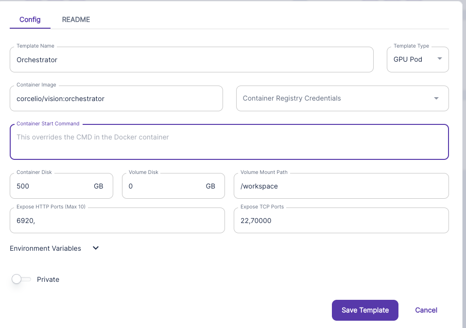
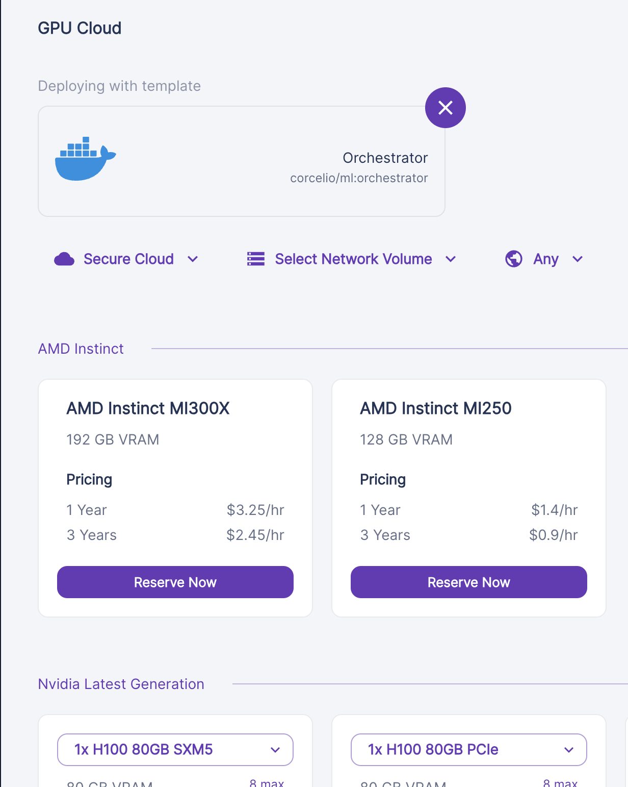

# Full instructions for setup

# Overview
A Validator consists of two parts:

- Proxy API server
- External GPU server

The proxy server is the server which has your hotkey, and spins up the axon, allows clients to query through you, etc. The External GPU server is the server (called the orchestrator) which performs the checking / scoring tasks!

I would advise starting with the checking / external server:

**⚠️USE CUDA <=12.2 PLEASE ON THE GPU DEVICES!! ⚠️**

# Starting the checking server
The code can be found here: https://github.com/namoray/vision-workers

There are two options:
- With baremetal, downloading and running the image manually (https://github.com/namoray/vision-workers/blob/main/validator_orchestrator/README.md)
- With vast, runpod, etc; using the template setup (below)

**⛔️ I've had significantly moer sucess with VAST (100% success rate) vs runpod (50%) success rate - IF YOU HAVE TROUBLES WITH RUNPOD, TRY ANOTHER PROVIDER!**

## Template setup
I'll use runpod as example, but it's the same process on any template provider 

**PLEASE NOTE, RUNPOD HAS A LOT OF SUBOPTIMAL GPUS. TRY TO USE A LOW CUDA VERSION (11.8, 12.0) IF YOU'RE USING RUNPOD**

### Checking server

- Navigate to https://www.runpod.io/console/user/templates
Create a new template


- **Fill out the template like so**


It's very important that port 6920 is exposed here, as well as TCP port 22 ( so you can ssh in if you need to)

Try to get as much storage as you can for future proofing! 500gb-1TB is ideal

- **Create a GPU pod with this instance**

Select the template to use, then pick a gpu to use, and you're off!
You need to pick a setup with at least 80GB vram (H100 or A100 for example).
I would advise just using an H100 or A100 for an easy life

**THIS WILL TAKE ABOUT 10-15 MINUTES TO SPIN UP AS IT DOWNLOADS ALL MODELS AN EVERYTHING FOR YOU!**

#### Getting the address of the server
Navigate to one of the pods, click 'connect', and then click the `connect to http port` button, and copy the URL in your browser


# Proxy setup steps

Get a CPU VM (Digital Ocean Droplet, OVH, Vultr, etc)  - make sure you have an open port if you want to run a organic API server.
**Note: Runpod CPU's don't seem to be the best**
If you pick a runpod cpu, i would advise running this
```bash
ulimit -n 4096
```

## Setup steps

Note: if you're using a provider such as runpod or vast, make sure you expose the necessary ports first, e.g.: https://docs.runpod.io/docs/expose-ports#:~:text=If%20your%20pod%20supports%20a,address%20to%20access%20your%20service. Follow the "Symmetrical port mapping" step :)

### Clone the repo
```bash
git clone https://github.com/namoray/vision.git
cd vision
git checkout vision_3
```

### Install system dependencies

If you are in a container such as runpod, run these:

```bash
### Install pm2 & jq
apt update && apt upgrade -y
apt install nodejs npm -y
npm i -g pm2
apt-get install -y jq

### Install nano so you can edit the config easily
apt-get update
apt-get install nano
```
If you are on a bare metal machine (e.g. Vast) where you require `sudo`, use the following:
```bash
### Install pm2 & jq
sudo apt update && apt upgrade -y
sudo apt install nodejs npm -y
sudo npm i -g pm2
sudo apt-get install -y jq

### Install nano so you can edit the config easily
sudo apt-get update
sudo apt-get install nano
``` 

### Install python dependencies
Make sure you have installed the correct python version (python 3.10). If you don't, try this:

```bash
sudo apt update && sudo apt install -y software-properties-common && \
sudo add-apt-repository ppa:deadsnakes/ppa && sudo apt install -y python3.10 \
python3.10-venv && python3.10 -m venv venv && source venv/bin/activate && echo "source venv/bin/activate">>~/.bashrc
```

```bash
### Install the local python environment
pip install --upgrade pip
pip install -e .
```

If for some reason that doesn't work, you may need to use `pip3`;
```bash
### Install the local python environment
pip3 install --upgrade pip
pip3 install -e .
```


### Get hot and coldkeys onto your machine
I trust we can do this at this point ;D

### Create config!

Follow the below step
```bash
vision create-config
```

### Creating the database
Used to store scoring logs

```bash
curl -fsSL -o /usr/local/bin/dbmate https://github.com/amacneil/dbmate/releases/latest/download/dbmate-linux-amd64
chmod +x /usr/local/bin/dbmate

dbmate --url "sqlite:validator_database.db" up
```


#### Starting the server

### With autoupdates

> **WARNING:** Autoupdates will work best if you use the `one gpu for all` setting in the config - otherwise if there is a new model we won't know what to do!

```bash
pm2 start --name run_validator_auto_update "python run_validator_auto_update.py"
```

**IF that doesn't start the validator server pm2 process, try this instead**

```bash
nohup python run_validator_auto_update.py </dev/null &>validator_autoupdate.log &
```

### Without auto updates
```bash
./launch_validators.sh
```

### Organic validator; managing access 

Using the vision-cli is the easiest way to manage access to your api server and sell access to anyone you like

```bash
vision --help
```

Shows all the commands and should give self-explanatory instructions.

You can also do

```bash
vision some-command --help
```

To get more info about that command!

# Examples

For example:

```bash
vision create-key 10 60 test
```
Creates a test key with a balance of 10 (which corresponds to 10 images), a rate limit of 60 requests per minute = 1/s, and a name 'test'.

**Recommend values:**
- Balance: Depends on how much you want to sell! Each credit is an image (so a balance of 1000 will allow 1000 images to be generated)
- Rate limit: I would recommend a rate limit of ~20/minute for casual users trying out the API, and around ~120/minute for production users
- Name: Just for you to remember who you want to use that key :)

Now you can do:
```bash
vision list-keys
```
To see the API key. Give / sell this access to whoever you want to have access to your API server to query the network organically - these will be scored too!

## Allowing people to access your server
For them to use your server, you will need to communicate:

- Your server address (IP_ADDRESS:PORT)
- Use /redoc or /docs for automatic documentation on how to use it!
