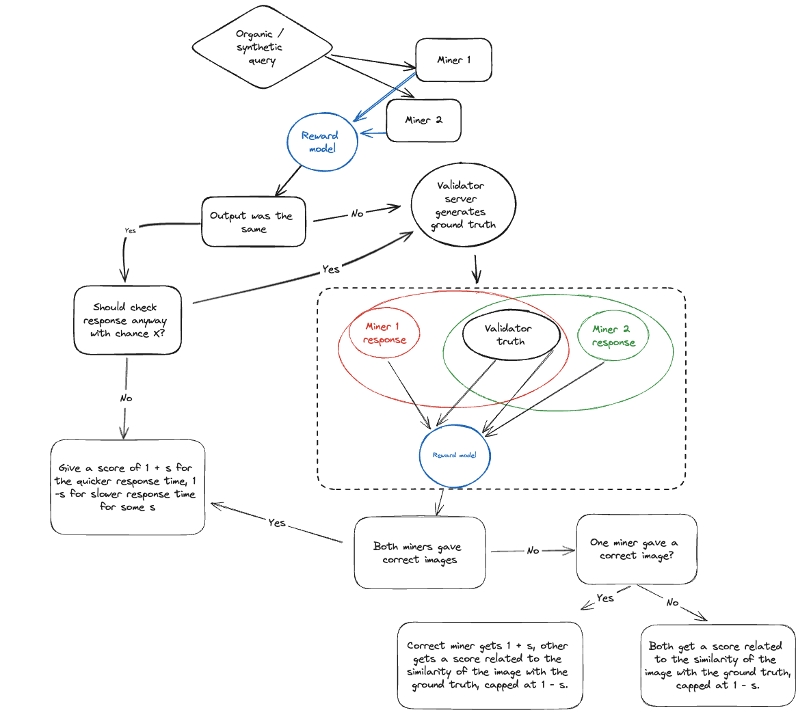

# Validator scoring criteria responses:

# 1. Uniqueness of the subnet, contribution to the overall Bittensor environment and ML community, long-term vision

Subnet 19 is the first, and only, subnet built to completely facilitate organic interactions. Validators can easily spin up their own API servers, and sell their access to the network to the free market, as they please - all while making sure the miners are scored on these queries. We're opening up Bittensor to the world, with enterprise scales in mind. 

This isn't just a concept though, it's currently used in production for multiple applications (listed in the next section). With this architecture, the free market will dictate which models are used and the price validators can sell their bandwidth for.

We're not going to stop with just our subnet, we're going to build this out so new subnets in the Bittensor can easily use the framework and really open their subnets up. We've done lots of research on this topic too to back it up:
- https://corcel.io/whitepapers/prioritisation-mechanism
- https://corcel.io/whitepapers/decentralised-subnet-inference-at-scale

On the subnet specifics, we're allowing the inference of a variety of vision based models models, with a range of parameters. These facilitate operations like text-to-image, image-to-image, upscaling, inpainting, controlnet (scribble), as well as generation of embeddings of images, which allows things like comparison of images (enabling image searches, similarity scoring, etc).

### Applications
We are probably the subnet with the most applications deployed on us right now - it's because we're built for it! 

Here are a few examples: 

- [Pixit](https://playpixit.com)
- [KizunaTesnor Telegram Bot](https://twitter.com/KizunaToken/status/1762992798444273745?t=EWW0Vu7j0f3DOGCC5CAXwA&s=19)
- [aiis.dev](https://aiis.dev/)
- [Image studio](https://app.corcel.io/image-studio)
    * [Generate Ultra](https://app.corcel.io/image-studio/app/generate-ultra)
    * [Uncrop](https://app.corcel.io/image-studio/app/uncrop)
    * [Scribble](https://app.corcel.io/image-studio/app/scribble)
    * [Inpaint](https://app.corcel.io/image-studio/app/inpaint)
    * [Upscale](https://app.corcel.io/image-studio/app/upscale)
    * [Reimagine](https://app.corcel.io/image-studio/app/reimagine)
- [Image chat](https://app.corcel.io/chat)
- [Spotlaight](https://www.spotlaight.com/)
- [Corcel discord bot](https://discord.com/invite/dR865yTPaZ)
- [Corcel API](https://api.corcel.io/docs)

I'm sure there are more - if you want your application adding to this list, please let me know!

## Future of 19 + DSIS 🚀

Longer term we will continue to support more and more models, since our infrastructure is built around supporting arbitrary operations. We will facilitate large scale API usage of the latest and greatest vision models, not just image generation. We also will continue to refine our own open source image reward model, which can accurately detect whether images were generated with the exact same parameters but on different hardware - which allows for a very robust rewards mechanism.

**Key future features include:**

-  **Subnet 19 for End Users**: Auto-scaling, fault tolerance, and reliability aspects will be catered to end users through Subnet 19.
-  **Simplified Validator Services**: Providing comprehensive services to validators with one-click validator launches and simple GUI's for managing access & payments
-  **Dynamic Resource Balance**: Allowing the running of an arbitrary number of models, at an enterprise scale

# 2. Reward Mechanism
There are two ways miners get scored - synthetic queries and organic queries.  

### Synthetic query generation:

- Text prompts: We use markov chains to randomly generate arbitrary prompts based on a large dataset.
- Images (some endpoints): We use picsum to get an image iff there have been no images generated previously through synthetic prompts; otherwise we use one of them (which cannot be predicted). For endpoints like scribble or inpainting, we use that image to generate a scribble outline / a mask.
- Height/Width/Guidance Scale/Seed: Picked at random from predefined allowed values

This results in an unlimited amount of different synthetic prompts, miners cannot cache or predict any responses. 

### Organic query generation:
- These come directly from real users using the subnet via decentralised inference. However, in order for miners to not be able to send everyone a prompt they already have a response to, we do NOT allow users to pick the seed in the case of an image generation. In the case of an embedding generation, we change just one or two pixels of the image a tiny bit, which will result in a different embedding being generated. This means miners CANNOT predict what answer they will need to provide for an organic prompt - which means they cannot get an advantage over any other miner. This is a super important consideration for the organic use of a subnet - and we are the only ones tackling this issue.

### Scoring
We have a very unique rewards mechanism on subnet 19, which is very robust. We have trained our own custom rewards model which can accurately detect whether images were generated with the exact same parameters but on different hardware. When we want to score a miner, we get a set of parameters P. We then send out the request to N miners (currently N=2, but is subject to variably increase). After the response, we run our reward model on the outputs, compare to see if they are the same, and score based on that. Here's a diagram that should make it clearer (or tries to :P):

The fallback for similarity is currently CLIP, but we cap the rewards at 1 - s, so there can never be an advantage by doing a CLIP embedding search.

The rewards model and fallback for the rewards model are, of course, not perfect, and will undergo continuous evaluation and improvement, based on ever growing datasets.

#### NSFW scoring
If we detect an image that is NSFW, we don't want to transfer that over the internet, so the miners do NOT return the image. Instead they return all the features necessary for the reward model, including the clip embeddings. This still lets us run all the models we need to, and crucially, ensures the miners still must run the model. If we didn't do this, miners would be able to send everyone NSFW prompts, and then just return an empty response each time without doing any calculations.

### Setting weights with scores
Due to subtensor issues, we've had to slightly adapt the scoring mechanism. Since we cannot guarantee that we will be able to set weights in every epoch, we are taking the approach of a moving average. 

Each scoring period is currently 10 minutes long defined [here](https://github.com/namoray/vision/blob/7bf552e9e81c1271c17ecb1e69aec67ce9cd8a5c/validation/validator_api_server/core_validator.py#L101). We average the score for each miner over that period, and keep the last N periods in memory (currently N=30) [see here](https://github.com/namoray/vision/blob/7bf552e9e81c1271c17ecb1e69aec67ce9cd8a5c/validation/validator_api_server/core_validator.py#L46C27-L46C35). We then take an average of all the averages and use that to assign the score for a miner.

I believe this is a key point to explore, as currently the distribution is slightly flatter than desired since we are needing to average over such a long period, to make sure validators stay in consensus, given some are not able to set weights for hundreds if not thousands of blocks at times. It will be a balancing act between these averages, and the variability in scores for 'winning' miners.

# 3. Community engagement
While I think we have very good response times to issues, usually measured in minutes and hours, and maintain a very active community presence, I think this is a question that can only be answered by the community - so I will leave it to them. The channel for 19 is **[here](https://discord.com/channels/799672011265015819/1186691482749505627)**

